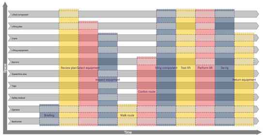

# 4D Activity Editor

This prototype Activity Modeller uses the techniques laid out in [“An Integrated Approach to Information Management: Identifying decisions and the information required for them using activity and process models”](https://www.cdbb.cam.ac.uk/news/publication-integrated-approach-information-management-identifying-decisions-and-information).  Discover the value of using data to model activities and what’s involved in them.

The application is a next.js web application built around the editor to provide support and guidance, as well as allow for hosting. When locally spun up all data remains on the device.

The editor is built upon the principles of 4-Dimensionalism. By design the user interface hides the theory and complexity, whilst providing you the benefits of such a comprehensive approach. This editor is part of ongoing research, and as such [feedback](link-to-discussion) is greatly appreciated.

## Getting Started

Follow the setup instructions in the editor readme found [here](editor-app/README.md).

## Contributing

Contributions to the project are welcome. Please follow the contribution guidelines found [here](CONTRIBUTING.md).

In brief:
- Check for existing issues or create an issue describing the enhancement you wish to make enabling any feedback / discussion before starting.
- Fork the repo to your account.
- Push all your changes to the new fork.
- Submit a pull request from the fork back to this main repo.

## Licence

4D Activity Editor is released under the terms of the  Apache 2.0 Licence [license](LICENCE.md).